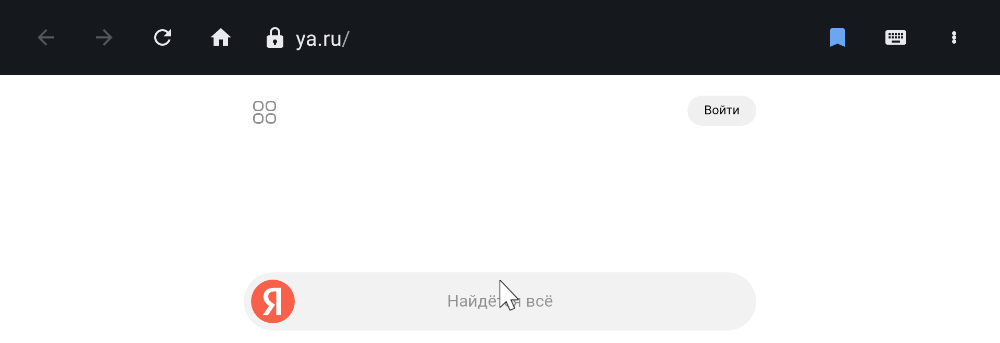
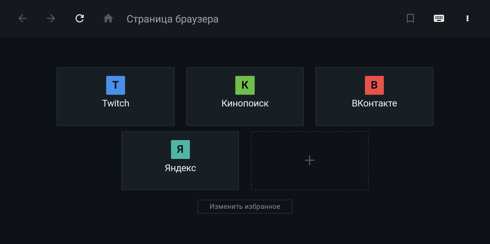
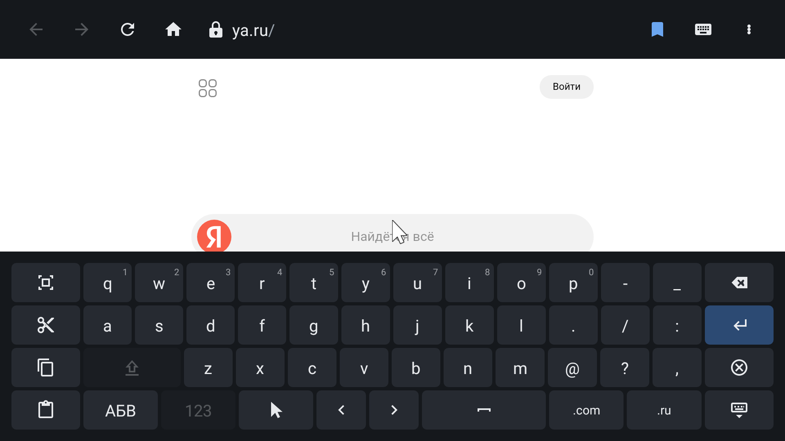
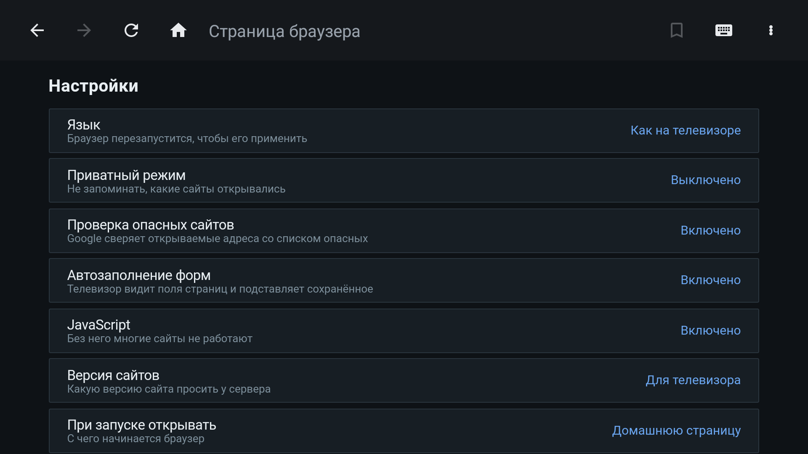
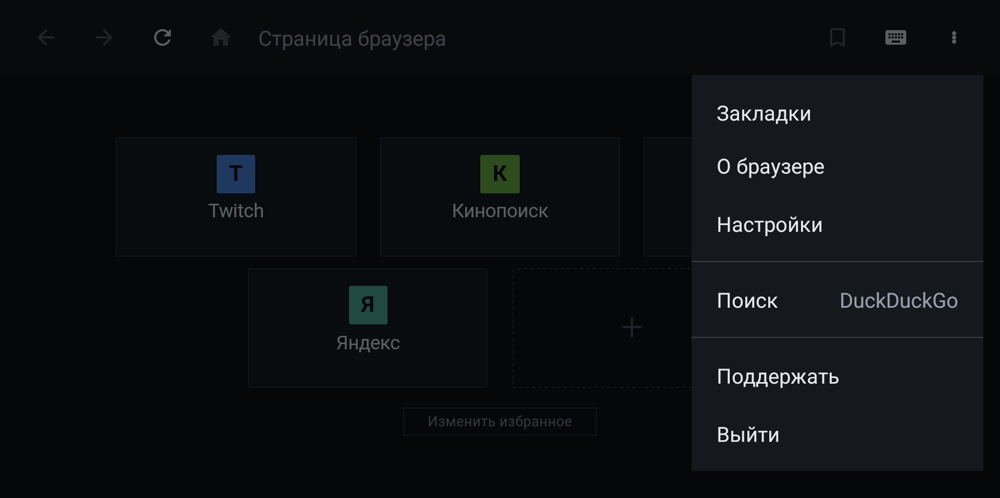
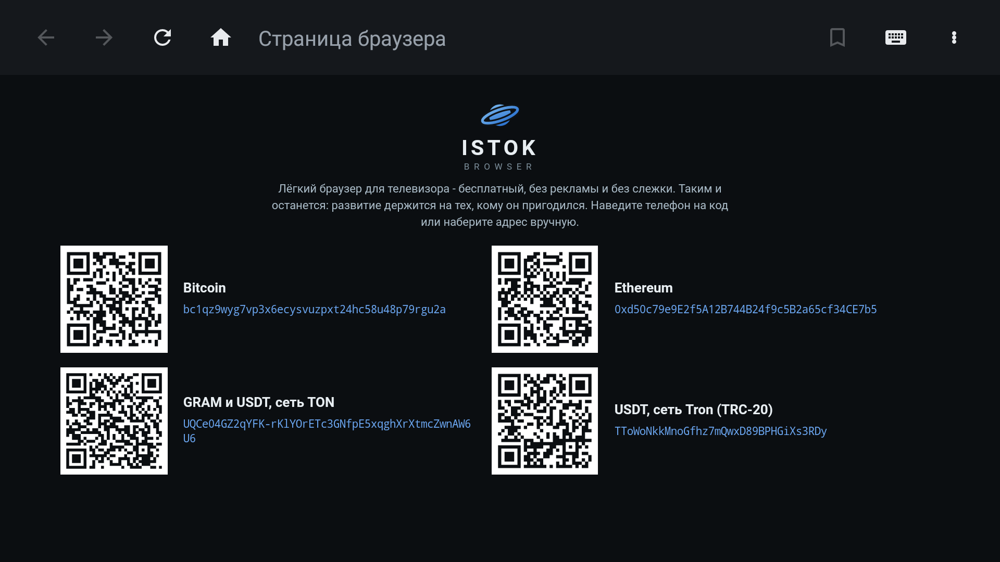

<div align="center">

<picture>
  <source media="(prefers-color-scheme: dark)" srcset="docs/logo-dark.png">
  
</picture>

**Настоящий интернет на экране телевизора. Обычным пультом.**

Istok открывает полные версии сайтов, а не урезанные ТВ-заглушки: по экрану ходит
курсор, которым вы управляете стрелками пульта. 139 КБ, ноль сторонних библиотек,
ноль слежки.

[](LICENSE)
[](#установка)
[](#установка)
[](#установка)



</div>

---

## Возможности

- **Курсор вместо прыжков по ссылкам.** Ускоряется при удержании стрелки, прокручивает
  страницу упором в край экрана, тянет ползунки в плеерах и раскрывает выпадающие списки.
  Работает то, что на телевизоре обычно недоступно вовсе.
- **Своя экранная клавиатура.** Плотная раскладка под пульт: цифры удержанием клавиши,
  русская и латинская раскладки, вставка из буфера обмена.
- **Избранное, закладки и история** на домашней странице. Всё добавляется, правится
  и удаляется с пульта, без единого захода в настройки.
- **Полноэкранное видео** с плашкой, которая называет настоящий адрес плеера.
- **Настройки под себя:** приватный режим, отключаемый JavaScript, выбор поисковика,
  мобильная или десктопная версия сайтов, русский и английский интерфейс.
- **Обновления по воздуху.** Браузер сам находит новую версию, скачивает её и проверяет
  подпись, а ставить или нет - решаете вы. Закладки и настройки остаются на месте.

<table>
<tr>
<td width="50%"><br><sub>Домашняя страница</sub></td>
<td width="50%"><br><sub>Экранная клавиатура</sub></td>
</tr>
<tr>
<td><br><sub>Настройки</sub></td>
<td><br><sub>Меню</sub></td>
</tr>
</table>

## Установка

Нужен Android 8.0 или новее. Браузер ставится файлом - это пять шагов, и все они
делаются пультом.

1. Скачайте `istok-<версия>.apk` со страницы
   [Releases](https://github.com/therebecore/istok-browser/releases).
2. Откройте скачанный файл на телевизоре.
3. Телевизор спросит разрешение ставить приложения из этого источника - разрешите.
4. Появится окно **"Приложение заблокировано для защиты устройства"**. В нём видно
   только кнопку "ОК", но это не тупик: нажмите **"Подробнее"** - строку со стрелкой
   под текстом.
5. Окно раскроется, и внизу слева появится **"Все равно установить"**. Нажмите её.

Готово, браузер установлен.

## Обновления

Браузер раз в сутки проверяет, вышла ли новая версия, и, если вышла, показывает полосу
"Вышла версия ...". Сам он ничего не ставит - решаете вы.

1. Нажмите **"Обновить"** в этой полосе. Браузер скачает новую версию и проверит, что
   она подписана тем же ключом, что и установленная.
2. Дальше запустится системный установщик, и Play Защита покажет **то же окно**, что
   при первой установке. Шаги те же: **"Подробнее"**, затем **"Все равно установить"**.

Закладки, избранное, история и настройки остаются на месте.

Проверить обновление вручную можно в любой момент: меню (три точки справа сверху),
"О браузере", "Проверить сейчас".

### Если хотите, чтобы окно Play Защиты больше не появлялось

Откройте Google Play, меню профиля, "Play Защита", шестерёнка настроек, и выключите
"Сканировать приложения на угрозы". Это решение владельца телевизора: проверка
перестанет предупреждать и о других приложениях тоже.

Само предупреждение не означает, что с браузером что-то не так. Play Защита смотрит не
на содержимое файла, а на то, знаком ли ей ключ подписи разработчика, и показывает это
окно для любого приложения мимо магазина.

### Для тех, кто проверяет файлы

SHA-256 каждого выпуска опубликован на его странице релиза. Браузер и сам сверяет
подпись скачанного обновления со своей перед тем, как отдать файл установщику: чужой
или подменённый APK он не поставит.

Страницы рисует системный Android System WebView, поэтому весь браузер занимает 139 КБ
и не замедляет телевизор.

## Приватность

Ни аналитики, ни телеметрии, ни сборщика падений, ни рекламных SDK. Аккаунт не нужен,
своего сервера у проекта нет: история и закладки лежат только на вашем телевизоре.
Подробно в [PRIVACY.md](PRIVACY.md), модель угроз в [docs/SECURITY.md](docs/SECURITY.md),
сообщить об уязвимости через [.github/SECURITY.md](.github/SECURITY.md).

## Собрать из исходников

```bash
git clone https://github.com/therebecore/istok-browser.git
cd istok-browser
./gradlew assembleRelease
```

Нужен JDK 17 и Android SDK с платформой 37. Сборка воспроизводима: сторонних
зависимостей нет, версии проверяются `gradle/verification-metadata.xml`.

## Поддержать

Браузер бесплатный и без рекламы, поэтому развивается только на энтузиазме
и на вашей поддержке. Проще всего поддержать криптовалютой: QR-коды и адреса
кошельков есть прямо в браузере, в меню, раздел "Поддержать".



| Сеть | Адрес |
|---|---|
| **Bitcoin** | `bc1qz9wyg7vp3x6ecysvuzpxt24hc58u48p79rgu2a` |
| **Ethereum** | `0xd50c79e9E2f5A12B744B24f9c5B2a65cf34CE7b5` |
| **TON** (GRAM и USDT) | `UQCe04GZ2qYFK-rKlYOrETc3GNfpE5xqghXrXtmcZwnAW6U6` |
| **Tron** (USDT TRC-20) | `TToWoNkkMnoGfhz7mQwxD89BPHGiXs3RDy` |

Помогает и бесплатное: звезда репозиторию, подробный баг-репорт и рассказ о том,
как браузер ведёт себя на вашей модели телевизора.

## Лицензия

[Apache License 2.0](LICENSE).

---

<details>
<summary><b>In English</b></summary>

## Istok Browser

**The real web on your TV screen, driven by the remote you already have.**

Istok loads full desktop sites instead of stripped-down TV versions: an on-screen cursor
follows your remote's arrow keys. It weighs 139 KB, ships zero third-party dependencies
and collects nothing about you.

**Features:** cursor navigation with acceleration, edge scrolling and drag support inside
players and dropdowns; a built-in on-screen keyboard designed for a remote; favourites,
bookmarks and history on the home screen; fullscreen video with a plate naming the real
host; private mode, optional JavaScript, search engine choice and an English or Russian
interface; over-the-air updates from GitHub with APK signature verification.

**Install:** Android 8.0 (API 26) or newer. Download the APK from
[Releases](https://github.com/therebecore/istok-browser/releases), open it on the TV and
allow installs from that source. Play Protect then blocks the install: the dialog shows
only "OK", so tap **"More details"** to expand it and **"Install anyway"** appears in the
bottom left. That is not a verdict on the browser - Play Protect flags every APK whose
signing key it has not seen before.

**Updating:** the browser checks for a new version daily and offers it in a bar; you
decide whether to install. It downloads the file and verifies the signature matches the
installed build, then hands it to the system installer - where the same Play Protect
dialog and the same two taps appear again. Bookmarks and settings survive. To check
manually: menu, "About", "Check now". To silence the dialog for good, turn off app
scanning under Google Play, Play Protect, settings. Pages are rendered by the system
Android System WebView.

**Privacy:** no analytics, no telemetry, no crash reporter, no ad SDK and no account.
The project runs no server of its own. Details in [PRIVACY.md](PRIVACY.md), threat model
in [docs/SECURITY.md](docs/SECURITY.md), vulnerability reports through
[.github/SECURITY.md](.github/SECURITY.md).

**Build:** `./gradlew assembleRelease` with JDK 17 and Android SDK platform 37.

**Support the project:** the browser is free and ad-free, so it lives on donations.
Wallet addresses are in the table above, and QR codes are built into the browser under
Menu, "Donate". A star or a detailed bug report helps just as much.

**License:** [Apache 2.0](LICENSE).

</details>
